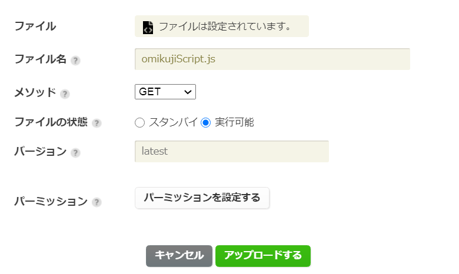
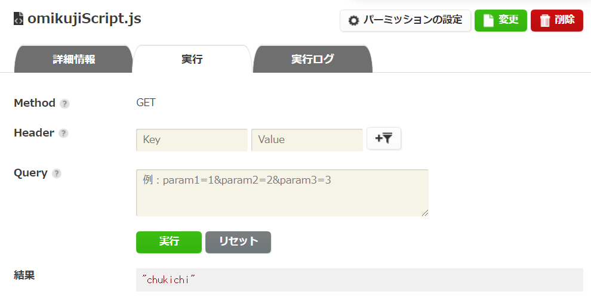
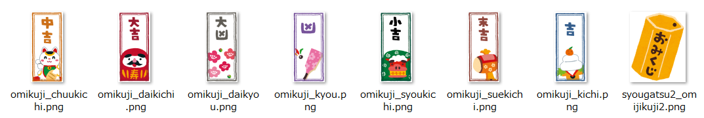

# ScriptOmikujiApp
【ニフクラ mobile backend スクリプト機能】おみくじアプリを作ってみよう

## はじめに
mobile backend のスクリプト機能を使ってみたいけどどこから手を付けたらいいものか・・・<br>
という方向けにスクリプト機能を活用した簡単なアプリ制作ができる「チュートリアル」を用意しました。<br>
<br>
手順通り進めるだけで簡単にアプリが完成できます。<br>
<br>
* 所要時間目安： 15分～30分程度

## 作成するアプリの概要

このチュートリアルで作成する「おみくじアプリ」にはあえて mobile backend の「スクリプト機能」を活用しています。

### ニフクラ mobile backend の「スクリプト機能」とは？

> サーバーサイドにスクリプトを設置できる機能です。
> 簡単なロジックを置くことで、独自機能の拡張などを行い、より柔軟にmobile backendをご利用いただけます。
> 管理画面から、もしくはAPI経由で、スクリプトの実行が可能です。
> クライアント側に持たせたくないロジックをクラウド側で処理させることで、チート対策やクライアントアプリの軽量化にも繋がります。
> 
> ■対応言語：JavaScript(Node.js) / Ruby

（https://mbaas.nifcloud.com/function.htm#script より抜粋）

---

「おみくじアプリ」を作成する上で重要になってくるのが、
* おみくじを引くと何がどれくらいの確率で出るのか？

ということです。この部分「結果の種類」とそれらの「確率」の情報を「スクリプト機能」を活用して、 __サーバー側__ に持たせて作成します。

### スクリプトを使うと何が良いのか？
おみくじを引くと「どんな結果」が「どんな確率」で出るのか、その情報をアプリ側に持たせて作成することももちろん可能です。しかし、サーバー側に「重要なデータ」を保持することが実は大切です！
* アプリを解析され、確率データを盗み取られたり、書き換えられたリなど、チート対策としても有効
* アプリ側のアップデートをしなくても、確率や結果の変更など自由に対応が可能

など、アプリ側は常にユーザーに触れる部分であるため、悪意のあるユーザーに渡れば解析され情報が書き変えられてしまう可能性があります。そこで、大事なデータをサーバーに置くことが有益となってくるわけです。さらに、アプリのアップデートは申請をして許可が下りるまで中々時間が掛かるものです。軽微な修正などは、アップデート無しで実装できたら嬉しいですよね。これも情報をサーバー側に保持しておくことで、サーバー側の修正を反映するだけでアプリ側のコンテンツマネジメントが可能になります。

それでは、スクリプトを活用するメリットが少しわかったところで、スクリプト機能を活用した「おみくじアプリ」を作成してみましょう。

## 事前準備
* 開発環境準備
   * Windows でも Mac でもブラウザとして「Google Chrome」のインストールされていれば利用可能です
* ニフクラ mobile backend アカウント作成 ＞ 下記URLよりSNSアカウントにて登録（無料）
   * https://mbaas.nifcloud.com/doc/current/
* Monaca または Monaca Education アカウント作成 ＞ 下記URLより登録（Freeプランあり）
   * Monaca https://monaca.mobi/ja/signup
   * Monaca Education https://monaca.education/ja/signup
* 任意の「テキストエディタ」をインストール
   *  JSファイル作成に必要です
   *  なんでもOKですが、「Atom」「サクラエディタ」などがおすすめです

## 作業内容
1. スクリプト作成と動作確認
2. アプリ（HTML/CSS/JS）の実装
3. 動作確認

## 作業手順
### 1.スクリプト作成と動作確認
スクリプトファイルの準備します。
* テキストエディタを起動して以下をコピペする

```js
module.exports = function(req, res) {
    // 「大吉、中吉、小吉、吉、末吉、凶、大凶」の順に確率を設定した配列
    var omikujiRatio = [16, 5, 5, 35, 5, 29, 5];
    var omikujiResult = ["daikichi", "chukichi", "syoukichi", "kichi", "suekichi", "kyou", "daikyou"];

    try {
        // check
        var rate = 0;
        for (var i = 0; i<omikujiRatio.length; i++) {
            var num = omikujiRatio[i];
            rate = rate + num;
        }
    
        if(rate != 100) {
            throw new Error("確率の設定に誤りがあります");
        }

        if(omikujiRatio.length != omikujiResult.length) {
            throw new Error("確率と結果の数が異なります");
        }

        // 1～100までの乱数作成（おみくじの結果を決定）
        var random = Math.floor( Math.random() * 99 ) + 1;

        for (var i=0; i<omikujiRatio.length; i++) {
            var min = 0;
            for(var j=0; j<i; j++) {
                min = min + omikujiRatio[j];
            }
            var max = 0;
            for(var j=0; j<i+1; j++) {
                max = max + omikujiRatio[j];
            }
            if(min < random && random <= max) {
                var result = omikujiResult[i];
                res.status(200);
                res.send(result);
            }
        }

    } catch(error) {
		res.status(400); 
		res.send(error.message); 
    }
}
```

* L3-4: おみくじの結果およびその出現確率をぞれぞれ配列で保持
* L7-20: L3-4で設定した情報設定に誤りがないか確認する処理
*  L23: 乱数を発生させ、その数値をおみくじの結果とする
   * L3で設定した確率をそのまま1～100に当てはめる
      * 例） `var omikujiRatio = [16, 5, 5, 35, 5, 29, 5];` の場合、1～16, 17～21, 22～26, 27～61, 62～66, 67～95, 96～100
* L25-39: L23で出た乱数の値が、それぞれの範囲に入っているかを確認し、含まれていた範囲に該当する結果を返却する

ファイル名を「omikujiScript.js」として任意の場所に保存します。
* 文字コードの指定がある場合は「UTF-8」を選択する
* BOMとかついていると失敗するので気を付ける

mobile backend 管理画面にログインし、アプリを作成します。
* 例）アプリ名「ScriptOmikujiApp」
* 既にアプリが１つ以上存在する場合は「新しいアプリ」をクリックして作成する
* （参考） https://mbaas.nifcloud.com/doc/current/introduction/div_quickstart_javascript_monaca.html#アプリの新規作成

アプリを作成すると管理画面が表示されるので、作成したスクリプトファイルをアップロードします。
* 管理画面を開いて「スクリプト」をクリックする
* 「アップロード」クリックする
* 「ファイルを選択」をクリックして先程任意の場所に保存した「omikujiScript.js」を選択する
* 「メソッド」は「GET」を選択する
* 「ファイルの状態」は「実行可能」を選択する
* 「アップロードする」をクリックする



動作テストをします。
* 一覧から「omikujiScript.js」を選びクリックすると右側に「詳細情報」が表示される
* 「実行」タブをクリックする
* 「実行」をクリックする
* 正しく作業できていれば「結果」におみくじの結果がローマ字で出力される



* 次の結果が出る場合は、ファイルのデプロイが完了していないため、少し時間をおいてからリトライしてください
   * `{"error":"Script is not yet deployed.","status":409,"code":"E409002"}`

### 2.アプリ（HTML/CSS/JS）の実装
Monacaにログインしてダッシュボードを開き、「新しいプロジェクトを作る」＞「最小限のテンプレート」からプロジェクトを作成します。
* 例）プロジェクト名「スクリプト活用おみくじアプリ」

作成したプロジェクトを開き、プロジェクトに mobile backend を Monaca から利用するための JavaScript SDK を導入します。
* 導入方法はドキュメントサイトを参照ください
  * https://mbaas.nifcloud.com/doc/current/introduction/div_quickstart_javascript_monaca.html#SDKのインストールと読み込み

アプリに表示する画像を用意します。本サンプルアプリでは「いらすとや」https://www.irasutoya.com/ を使わせていただきました。

* 以下URLからおみくじ本体およびおみくじの結果（７種）の合わせて８つの画像を取得する
  * https://www.irasutoya.com/search?q=おみくじ


