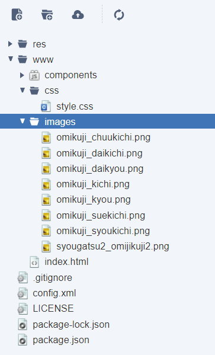

# ScriptOmikujiApp
【ニフクラ mobile backend スクリプト機能】おみくじアプリを作ってみよう

作成日：2020/12/14

## 目次
<!-- START doctoc generated TOC please keep comment here to allow auto update -->
<!-- DON'T EDIT THIS SECTION, INSTEAD RE-RUN doctoc TO UPDATE -->

- [はじめに](#%E3%81%AF%E3%81%98%E3%82%81%E3%81%AB)
- [作成するアプリの概要](#%E4%BD%9C%E6%88%90%E3%81%99%E3%82%8B%E3%82%A2%E3%83%97%E3%83%AA%E3%81%AE%E6%A6%82%E8%A6%81)
  - [ニフクラ mobile backend の「スクリプト機能」とは？](#%E3%83%8B%E3%83%95%E3%82%AF%E3%83%A9-mobile-backend-%E3%81%AE%E3%82%B9%E3%82%AF%E3%83%AA%E3%83%97%E3%83%88%E6%A9%9F%E8%83%BD%E3%81%A8%E3%81%AF)
  - [スクリプトを使うと何が良いのか？](#%E3%82%B9%E3%82%AF%E3%83%AA%E3%83%97%E3%83%88%E3%82%92%E4%BD%BF%E3%81%86%E3%81%A8%E4%BD%95%E3%81%8C%E8%89%AF%E3%81%84%E3%81%AE%E3%81%8B)
- [事前準備](#%E4%BA%8B%E5%89%8D%E6%BA%96%E5%82%99)
- [作業内容](#%E4%BD%9C%E6%A5%AD%E5%86%85%E5%AE%B9)
- [作業手順](#%E4%BD%9C%E6%A5%AD%E6%89%8B%E9%A0%86)
  - [1.スクリプト作成と動作確認](#1%E3%82%B9%E3%82%AF%E3%83%AA%E3%83%97%E3%83%88%E4%BD%9C%E6%88%90%E3%81%A8%E5%8B%95%E4%BD%9C%E7%A2%BA%E8%AA%8D)
  - [2.アプリ（HTML/CSS/JS）の実装](#2%E3%82%A2%E3%83%97%E3%83%AAhtmlcssjs%E3%81%AE%E5%AE%9F%E8%A3%85)
  - [3.動作確認](#3%E5%8B%95%E4%BD%9C%E7%A2%BA%E8%AA%8D)
- [おわりに](#%E3%81%8A%E3%82%8F%E3%82%8A%E3%81%AB)
  - [スクリプトファイルの更新方法](#%E3%82%B9%E3%82%AF%E3%83%AA%E3%83%97%E3%83%88%E3%83%95%E3%82%A1%E3%82%A4%E3%83%AB%E3%81%AE%E6%9B%B4%E6%96%B0%E6%96%B9%E6%B3%95)

<!-- END doctoc generated TOC please keep comment here to allow auto update -->

## はじめに
mobile backend のスクリプト機能を使ってみたいけどどこから手を付けたらいいものか・・・<br>
という方向けにスクリプト機能を活用した簡単なアプリ制作ができる「チュートリアル」を用意しました。<br>
<br>
手順通り進めるだけで簡単にアプリが完成できます。<br>
<br>
* 所要時間目安： 15分～30分程度

## 作成するアプリの概要

このチュートリアルで作成する「おみくじアプリ」にはあえて mobile backend の「スクリプト機能」を活用しています。

### ニフクラ mobile backend の「スクリプト機能」とは？

アプリ側のロジックの一部をサーバー側に置いて実行できる機能です。

> サーバーサイドにスクリプトを設置できる機能です。
> 簡単なロジックを置くことで、独自機能の拡張などを行い、より柔軟にmobile backendをご利用いただけます。
> 管理画面から、もしくはAPI経由で、スクリプトの実行が可能です。
> クライアント側に持たせたくないロジックをクラウド側で処理させることで、チート対策やクライアントアプリの軽量化にも繋がります。
>
> ■対応言語：JavaScript(Node.js) / Ruby

（https://mbaas.nifcloud.com/function.htm#script より抜粋）


### スクリプトを使うと何が良いのか？

「おみくじアプリ」を作成する上で重要になってくるのは、

* おみくじを引くと「どんな結果」が「どんな確率」で出るのか

ということです。本チュートリアルではこの部分を「スクリプト機能」を活用して、 __サーバー側__ に持たせて作成していきますが、情報をアプリ側に持たせて作成することももちろん可能です。しかし、次の2つの観点から「 __重要なデータ__ 」や「 __重要な処理__ 」についてはアプリ側に保持せず、サーバー側にを保持することがとても大切です。

* アプリを解析され、確率データを盗み取られたり書き換えられたりなどを防ぐ、 __チート対策__ として有効！
   * アプリ側は常にユーザーに触れる部分であるため、悪意のあるユーザーに渡れば解析され情報が書き変えられてしまう可能性に常に晒されています
   * サーバーに置くだけで格段に解析は難しくなり、大切な情報や処理を守ることが可能になります
* アプリのアップデートをしなくても、確率や結果の変更など自由に対応が可能
   * データや処理をアプリ側ではなくサーバー側に保持しているため、その更新のためにわざわざアップデートに時間を割く必要がありません
   * サーバー側の修正を反映するだけでアプリ側のコンテンツマネジメントが可能になります

それでは、スクリプトを活用するメリットが少しわかったところで、スクリプト機能を活用した「おみくじアプリ」を作成してみましょう。

## 事前準備
* 開発環境準備
   * Windows でも Mac でもブラウザとして「Google Chrome」のインストールされていれば利用可能です
* ニフクラ mobile backend アカウント作成 ＞ 下記URLよりSNSアカウントにて登録（無料）
   * https://mbaas.nifcloud.com/doc/current/
* Monaca または Monaca Education アカウント作成 ＞ 下記URLより登録（Freeプランあり）
   * Monaca https://monaca.mobi/ja/signup
   * Monaca Education https://monaca.education/ja/signup
* 任意の「テキストエディタ」をインストール
   *  JSファイル作成に必要です
   *  なんでもOKですが、「Atom」「サクラエディタ」などがおすすめです

## 作業内容
1. スクリプト作成と動作確認
2. アプリ（HTML/CSS/JS）の実装
3. 動作確認

※本チュートリアルの手順通り実装しても正しく動作しない場合、「Issues」＞「New issue」より issue を作成（タイトル及び概要の入力）の上、ご報告ください。順次改修いたします。

## 作業手順
### 1.スクリプト作成と動作確認
スクリプトファイルの準備します。
* テキストエディタを起動して以下をコピペする

```js
module.exports = function(req, res) {
    // 「大吉、中吉、小吉、吉、末吉、凶、大凶」の順に確率を設定した配列
    var omikujiRatio = [16, 5, 5, 35, 5, 29, 5];
    var omikujiResult = ["daikichi", "chukichi", "syoukichi", "kichi", "suekichi", "kyou", "daikyou"];

    try {
        // check
        var rate = 0;
        for (var i = 0; i<omikujiRatio.length; i++) {
            var num = omikujiRatio[i];
            rate = rate + num;
        }

        if(rate != 100) {
            throw new Error("確率の設定に誤りがあります");
        }

        if(omikujiRatio.length != omikujiResult.length) {
            throw new Error("確率と結果の数が異なります");
        }

        // 1～100までの乱数作成（おみくじの結果を決定）
        var random = Math.floor( Math.random() * 99 ) + 1;

        for (var i=0; i<omikujiRatio.length; i++) {
            var min = 0;
            for(var j=0; j<i; j++) {
                min = min + omikujiRatio[j];
            }
            var max = 0;
            for(var j=0; j<i+1; j++) {
                max = max + omikujiRatio[j];
            }
            if(min < random && random <= max) {
                var result = omikujiResult[i];
                res.status(200);
                res.send(result);
            }
        }

    } catch(error) {
		res.status(400);
		res.send(error.message);
    }
}
```

* L3-4: おみくじの結果およびその出現確率をぞれぞれ配列で保持
* L7-20: L3-4で設定した情報設定に誤りがないか確認する処理
*  L23: 乱数を発生させ、その数値をおみくじの結果とする
   * L3で設定した確率をそのまま1～100に当てはめる
      * 例） `var omikujiRatio = [16, 5, 5, 35, 5, 29, 5];` の場合、1～16, 17～21, 22～26, 27～61, 62～66, 67～95, 96～100
* L25-39: L23で出た乱数の値が、それぞれの範囲に入っているかを確認し、含まれていた範囲に該当する結果を返却する

ファイル名を「omikujiScript.js」として任意の場所に保存します。
* 文字コードの指定がある場合は「UTF-8」を選択する
* BOMとかついていると失敗するので気を付ける

mobile backend 管理画面にログインし、アプリを作成します。
* 例）アプリ名「ScriptOmikujiApp」
* 既にアプリが１つ以上存在する場合は「新しいアプリ」をクリックして作成する
* （参考） https://mbaas.nifcloud.com/doc/current/introduction/div_quickstart_javascript_monaca.html#アプリの新規作成

アプリを作成すると管理画面が表示されるので、作成したスクリプトファイルをアップロードします。
* 管理画面を開いて「スクリプト」をクリックする
* 「アップロード」クリックする
* 「ファイルを選択」をクリックして先程任意の場所に保存した「omikujiScript.js」を選択する
* 「メソッド」は「GET」を選択する
* 「ファイルの状態」は「実行可能」を選択する
* 「アップロードする」をクリックする


動作テストをします。
* 一覧から「omikujiScript.js」を選びクリックすると右側に「詳細情報」が表示される
* 「実行」タブをクリックする
* 「実行」をクリックする
* 正しく作業できていれば「結果」におみくじの結果がローマ字で出力される


* 次の結果が出る場合は、ファイルのデプロイが完了していないため、少し時間をおいてからリトライしてください
   * `{"error":"Script is not yet deployed.","status":409,"code":"E409002"}`

### 2.アプリ（HTML/CSS/JS）の実装
Monacaにログインしてダッシュボードを開き、「新しいプロジェクトを作る」＞「最小限のテンプレート」からプロジェクトを作成します。
* 例）プロジェクト名「スクリプト活用おみくじアプリ」

作成したプロジェクトを開き、プロジェクトに mobile backend を Monaca から利用するための JavaScript SDK を導入します。
* 導入方法はドキュメントサイトを参照ください
  * https://mbaas.nifcloud.com/doc/current/introduction/div_quickstart_javascript_monaca.html#SDKのインストールと読み込み

アプリに表示する画像を用意します。本サンプルアプリでは「いらすとや」https://www.irasutoya.com/ を使わせていただきました。

* 以下URLからおみくじ本体およびおみくじの結果（７種）の合わせて８つの画像を取得する
  * https://www.irasutoya.com/search?q=おみくじ


* 「index.html」と同じ階層に「images」フォルダを作成する
* 作成した「images」フォルダに取得した８つの画像をインポートする
   * 「いらすとや」の画像を使わない場合も、ファイル名は同じものを使ってください。（※１）




画像の準備が終わったら、コーディングを行っていきます。まず、「CSS」フォルダから「style.css」を開いて、次のように書き換えます。

```css
.omikuji {
    width: 100%;
}
.omikuji-body{
    width: 250px;
    height: 250px;
    margin: 20px auto;

    background-image: url(../images/syougatsu2_omijikuji2.png);
    background-repeat: no-repeat;
    background-size: contain;
    background-position: center center;
}

.omikuji-result{
    width: 250px;
    height: 250px;
    margin: 20px auto;

    background-repeat: no-repeat;
    background-size: contain;
    background-position: center center;
}

/* おみくじの回転 */
@keyframes omikuji-go {
    0% {
        transform: rotate(0);
    }
    100% {
        transform: rotate(180deg);
    }
}

@keyframes omikuji-back {
    0% {
        transform:rotate(180deg);
    }
    100% {
        transform:rotate(360deg);
    }
}
```
* おみくじ本体画像の表示や、そのアニメーションなどの設定をしています

編集が終わったら、プロジェクトを保存します。次に「index.html」を開き、bodyタグを次のように書き変えます。

```html
<body>
    <div class="omikuji">
        <div class="omikuji-pull">
            <input type="button" onclick="pullOmikuji()" value="おみくじを引く">
        </div>
        <div class="omikuji-body"></div>
        <div class="omikuji-result"></div>
    </div>
</body>
```
* 「おみくじを引く」ボタンの設置と、おみくじの結果として画像を表示するためのタグを用意しています

プロジェクトを保存すると、プレビュー画面には次のように表示されることが確認できます。


最後に同じ「index.html」のscriptタグを次のように書き変えます。

```html
<script>        
    var applicationKey = "YOUR_APPLICATIONKEY";
    var clientKey = "YOUR_CLIENTKEY";
    var ncmb = new NCMB(applicationKey, clientKey);

    function pullOmikuji() {
        /* スクリプト実行 */
        ncmb.Script
            .exec("GET", "omikujiScript.js")
            .then(function(res){
                // スクリプト実行成功時の処理
                var result = res.body;
                getResult(result);
            })
            .catch(function(err){
                // スクリプト実行失敗時の処理
                document.querySelector(".omikuji-result").innerText = err;
                console.log(JSON.stringify(err));
            });
    }

    function getResult(result) {
        // おみくじを回す
        document.querySelector(".omikuji-body").style.animation = "2s omikuji-go ease-out forwards";
        // 2秒後に実行する
        setTimeout(function() {
            // 結果を表示する
            document.querySelector(".omikuji-result").style.backgroundImage = "url(images/omikuji_" + result + ".png)";
            // おみくじを戻す
            document.querySelector(".omikuji-body").style.animation = "2s omikuji-back ease-in forwards";
        }, 2000);
    }
</script>
```
* L2-3の「`YOUR_APPLICATIONKEY`」と「`YOUR_CLIENTKEY`」には mobile backend でアプリ作成時に払い出されたAPIキーを設定してください
  * （参考） https://mbaas.nifcloud.com/doc/current/introduction/div_quickstart_javascript_monaca.html#アプリの新規作成
* L2-4: APIキーの設定を初期化
* L6-20: 「おみくじを引く」ボタンが押されたら呼び出されるメソッド内でスクリプト「omikujiScript.js」の実行
* L13: 取得結果（おみくじの結果（ローマ字））を引き数に設定して画面表示処理を行うメソッドの呼び出し
* L22-32: 画面表示処理として、おみくじを回すアニメーションを実行し、アニメーションが終わるのと同時に結果を画面に表示しておみくじを元に戻す処理を実施

### 3.動作確認

編集が終わったら、プロジェクトを保存し、プレビュー画面を確認します。

* 「おみくじを引く」ボタンを押します
* おみくじの画像が回転して結果が表示されます
* 結果が表示されるとおみくじの画像が回転して元に戻ります


## おわりに

おみくじの確率設定は今回以下ブログ記事を参考に実際の神社と同じ（と思われる）設定にしています。
* （参考）よく分かる！神社おみくじの正しい順番！大吉・凶が出る確率は？ http://choi-nico.com/omikuji_junjo-1700

ですが、もちろん確率は自由に設定変更が可能です。変更する場合は、アプリ側は変更不要で、サーバー側のスクリプトファイルのL3-4「配列の値」を変更します。例えば、「大凶」が出なく（0% または削除）したり、「大大吉」が1%だけ出るようにしたりなど、好きなようにカスタマイズができます
* L4で結果を追加または削除したら、L3の確率もそれに合わせて変更する必要があります
* L3の配列の値が合計で100になるように設定してください

L3-4の設定に誤りがあるとエラーが出るように作成していますので、いろいろ試してみてください！
なお、変更したスクリプトファイルを再度アップロード（デプロイ）する方法は以下を参考にしてください。

### スクリプトファイルの更新方法
* 管理画面を開いて「スクリプト」をクリックする
* 更新するスクリプトファイルを「一覧」から選びクリックします
* 右側に詳細画面が表示されるので、その中にある「変更」ボタンをクリックします
* 「ファイル本体の変更」で「変更する」をクリックします
* 「ファイルを選択」をクリックして更新したファイルを選択します


* 「変更する」をクリックします

---

（※１）ファイル名を指定してコーディングしてあるので、ファイル名を変更したい場合は以下箇所の修正も合わせて必要です。
* CSS/style.css L9:
   * `background-image: url(../images/syougatsu2_omijikuji2.png);`
* index.html＞script L28:
   * `document.querySelector(".omikuji-result").style.backgroundImage = "url(images/omikuji_" + result + ".png)";`
